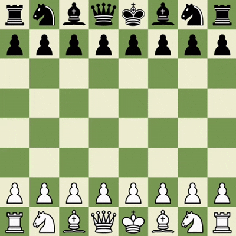

# Negamax Knight♟️

This is a lightweight chess engine and GUI built in Python using Pygame. It supports human vs. human play as well as human vs. AI. The AI uses alpha-beta search with configurable depth, and the interface includes move animations, sound effects, undo/reset functionality, and move logging.

## Preview



## Features

- Graphical Board: Renders an 8×8 chessboard with piece images.
- Move Animation: Smooth piece sliding animations for each move.
- Sound Effects: Plays unique sounds for standard moves, captures, checks, castling, and pawn promotions.
- Human vs. Human: Two-player mode on the same machine.
- Human vs. AI: AI opponent powered by alpha-beta search. Configurable search depth (default: 3 plies).
- Undo / Reset: Undo one or more moves using Z, and reset the board to the starting position using R.
- Move Highlighting: Highlights the selected square and all legal moves from that square.
- Advanced Chess Rules: Supports rules like castling (king-side and queen-side), pawn promotion, and en passant captures.


## How to run 🕹️

Clone the project

```bash
  git clone https://github.com/Parthgogia/Negamax-knight.git
```

Go to the project directory

```bash
  cd Negamax-knight
```

Install dependencies

```bash
  pip install pygame
```

Run the game:

```bash
  python main.py
```


## Gameplay

### Player Mode
You can configure which side(s) the human player controls by setting the following constants in main.py:

Human vs Human:
```bash
PLAY_AS_WHITE = True
PLAY_AS_BLACK = True
```

Human vs. AI (play as White)
```bash
PLAY_AS_WHITE = True
PLAY_AS_BLACK = False
```

Human vs. AI (play as Black)
```bash
PLAY_AS_WHITE = False
PLAY_AS_BLACK = True
```


### Controls

The chess engine is designed to be intuitive and responsive.

🖱️ Selecting a Piece

Click on any piece you wish to move. The selected square will be highlighted.


➡️ Moving a Piece

Once a piece is selected, its legal destination squares will be highlighted on the board.
Click on one of the highlighted squares to move the piece.

The game automatically enforces all standard chess rules, including legal move validation, captures, pawn promotion, castling (both sides), and en passant.

⌨️ Keyboard Shortcuts

Z – Undo the last move. (In Human vs. AI mode, it undoes both the human and AI moves.)

R – Reset the game to its initial state.


### AI Search Depth

The DEPTH constant specifies how many plies (half‑moves) ahead the engine will search when choosing its move. Higher values yield stronger play but require more processing time—so keeping DEPTH at 4 or below is recommended for a good balance of strength and speed.

To change the search depth, open algorithms.py and adjust the line:
```bash
 DEPTH = 3
 ```